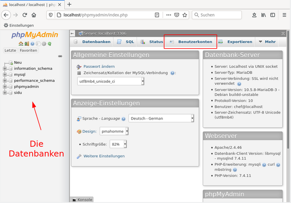
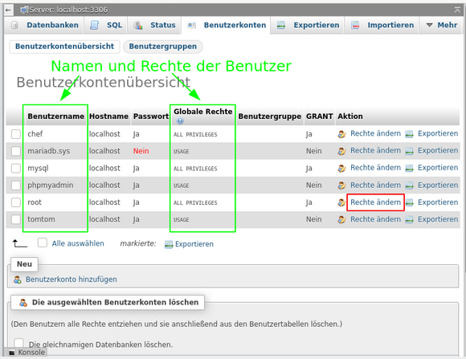
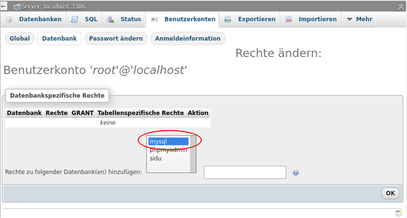
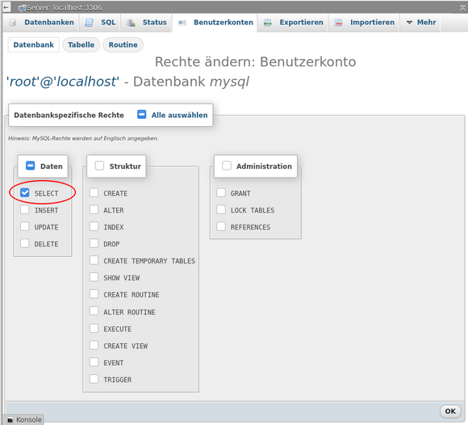

% LAMP - MariaDB 

## MariaDB einrichten

### MariaDB im Dateisystem

Debian hat die Dateien von MariaDB entsprechend ihrer Funktion vollständig in das Dateisystem integriert.

+ In **/usr/bin/** das ausführbare Programm *mariadb*  
    + und der Link *mysql*, der auf */usr/bin/mariadb* verweist.  
+ In **/usr/lib/mysql/plugin/** die installierten Plugin für MariaDB.  
+ In **/usr/share/mysql/** Gemeinsam genutzte Programmteile und Lokalisierungen.  
+ In **/etc/mysql/** die Konfigurationsverzeichnisse und -dateien.  
+ In **/var/lib/mysql/** die Datenbanken und Log-Dateien.  
+ In **/run/mysqld/** zur Laufzeit notwendige Systemdateien.

Innerhalb der zuvor genannten Verzeichnisse sollten die Dateien tunlichst nicht manuell bearbeitet werden. Einzige Ausnahme ist die Konfiguration von MariaDB unterhalb */etc/mysql/*, sofern man genau weiß wie vorzugehen ist. Anderen Falls benutzt man das [MariaDB-CLI](#mariadb-cli) oder ein Frontend wie [phpMyAdmin](#phpmyadmin).

### Erstkonfiguration

Nach der Installation, wie sie in [LAMP-Testserver für Entwickler](./lamp-start_de.md#lamp-webserver) beschrieben wurde, ist MariaDB *'offen wie ein Scheunentor für jedermann'*, denn in der Grundeinstellung werden die beiden Benutzer *root* und *anonymous*, ohne Passwort erstellt und eine Testdatenbank angelegt.

Deshalb rufen wir das Programm **mysql_secure_installation** im Root-Terminal auf.  
Hier nehmen wir eine ganze Reihe von Einstellungen zur Absicherung der Datenbank vor. Die notwendigen Eingaben sind so gekennzeichnet: "«- - [ ]".

~~~
# mysql_secure_installation  

In order to log into MariaDB to secure it, we'll need the current
password for the root user. If you've just installed MariaDB, and
you haven't set the root password yet, the password will be blank,
so you should just press enter here.

Enter current password for root (enter for none): «--[Enter]  
OK, successfully used password, moving on...

Setting the root password or using the unix_socket ensures that nobody can  
log into the MariaDB root user without the proper authorisation.

You already have your root account protected, so you can safely answer 'n'.

Switch to unix_socket authentication [Y/n]:   «--[n]  
 ... skipping.

You already have your root account protected, so you can safely answer 'n'.

Change the root password? [Y/n]:   «--[y]  
New password:                      «--[mein_mariadb_root_passwort]  
Re-enter new password:             «--[mein_mariadb_root_passwort]  
Password updated successfully!  
Reloading privilege tables..  
... Success!

By default, a MariaDB installation has an anonymous user, allowing anyone
to log into MariaDB without having to have a user account created for
them. This is intended only for testing, and to make the installation
go a bit smoother. You should remove them before moving into a
production environment.

Remove anonymous users? [Y/n]:   «--[y]  
... Success!

Normally, root should only be allowed to connect from 'localhost'. This
ensures that someone cannot guess at the root password from the network.

Disallow root login remotely? [Y/n]   «--[y]  
... Success!

By default, MariaDB comes with a database named 'test' that anyone can
access. This is also intended only for testing, and should be removed
before moving into a production environment.

Remove test database and access to it? [Y/n]   «--[y]  
- Dropping test database...  
... Success!  
- Removing privileges on test database...  
... Success!

Reloading the privilege tables will ensure that all changes made so far
will take effect immediately.

Reload privilege tables now? [Y/n]   «--[y]
... Success!

Cleaning up...

All done! If you've completed all of the above steps, your MariaDB  
installation should now be secure.

Thanks for using MariaDB!
~~~

Im Ergebnis hat der Benutzer *root* ein (hoffentlich sicheres) Passwort erhalten und er kann sich nicht mehr remote einloggen. Der Benutzer *anonymous* und die Datenbank *Test* wurden entfernt.

### MariaDB CLI

Das Commandline Interface erreichen wir im Terminal durch die Eingabe von "*mariadb -u \<user\> -p*". Nach der Eingabe des Passwortes sehen wir die Begrüßung und den neuen Promt `MariaDB [(none)]>`.

~~~
# mariadb -u root -p
Enter password:
Welcome to the MariaDB monitor.  [...]

MariaDB [(none)]>
~~~

Aus Sicherheitsgründen loggen wir uns nur zu Beginn als **Benutzer root** ein, um die Projektdatenbank, einen  Benutzer für die alltäglichen Arbeiten an dieser und einen Benutzer als Ersatz für *root* anzulegen.  
Später im Abschnitt [phpMyAdmin](#phpmyadmin) entziehen wir dem Benutzer *root* die allumfassenden Rechte, damit ein potentieller Angreifer an dieser Stelle erfolglos bleibt.

#### Eine Datenbank anlegen

Wir sind noch im Terminal angemeldet und erstellen für unser Projekt eine neue Datenbank:

~~~
MariaDB [(none)]> CREATE DATABASE sidu;
Query OK, 1 row affected (0.002 sec)
~~~

Das ist schon alles. Falls wir diese Datenbank löschen wollen lautet der Befehl "DROP DATABASE sidu;"

#### Einen Benutzer anlegen

Zuerst erstellen wir unseren Projekt-Benutzer mit dem Namen *tomtom* und weisen ihm ausschließlich alle Rechte an der Projekt-Datenbank *sidu* zu:

~~~
MariaDB [(none)]> CREATE USER tomtom@localhost IDENTIFIED BY '<hier ein Passwort für tomtom eingeben>';
Query OK, 0 rows affected (0.002 sec)

MariaDB [(none)]> GRANT ALL ON sidu.* TO tomtom@localhost;
Query OK, 0 rows affected (0.001 sec)
~~~

Nun die gleiche Prozedur für den Benutzer *chef*, der die Aufgabe von *root* übernehmen soll.

~~~
MariaDB [(none)]> CREATE USER chef@localhost IDENTIFIED BY '<hier ein Passwort für chef eingeben>';
Query OK, 0 rows affected (0.002 sec)

MariaDB [(none)]> GRANT ALL ON *.* TO chef@localhost WITH GRANT OPTION;
Query OK, 0 rows affected (0.001 sec)

MariaDB [(none)]> FLUSH PRIVILEGES;
~~~

Die neuen Benutzer unterscheiden sich in ihren Rechten.

*tomtom* hat alle Rechte **nur** für die Datenbank *sidu* (sidu.\*).  
*chef* hat alle Rechte an allen Datenbanken (\*.\*) und Benutzern (WITH GRANT OPTION).

Der Benutzer *chef* kann somit die Funktion des Benutzers *root* übernehmen und den Benutzer *tomtom* verwenden wir für Arbeiten an unserer Projektdatenbank.  
Den Logout erledigt: **`\q`**.

~~~
MariaDB [(none)]> \q
Bey
#
~~~

#### Abfragen

Wir schauen uns das Ergebnis in Terminal an, diesmal als Benutzer "*chef*".  
Zuerst die Benutzer und dann die vorhandenen Datenbanken.

~~~
MariaDB [(none)]> SELECT User,Host FROM mysql.user;
+-------------+-----------+
| User        | Host      |
+-------------+-----------+
| chef        | localhost |
| mariadb.sys | localhost |
| mysql       | localhost |
| phpmyadmin  | localhost |
| root        | localhost |
| tomtom      | localhost |
+-------------+-----------+
6 rows in set (0.002 sec)

MariaDB [(none)]> SHOW DATABASES;
+--------------------+
| Database           |
+--------------------+
| information_schema |
| mysql              |
| performance_schema |
| phpmyadmin         |
| sidu               |
+--------------------+
5 rows in set (0.001 sec)
~~~

Wenn wir uns von MariaDB abmelden und als Benutzer *"tomtom"* wieder anmelden, sehen die beiden Abfragen wie folgt aus:

~~~
MariaDB [(none)]> SELECT User,Host FROM mysql.user;
ERROR 1142 (42000): SELECT command denied to user 'tomtom'@'localhost' for table 'user'

MariaDB [(none)]> SHOW DATABASES;
+--------------------+
| Database           |
+--------------------+
| information_schema |
| sidu               |
+--------------------+
2 rows in set (0.001 sec)
~~~

Es ist gut zu erkennen, dass der Benutzer *"tomtom"* keinen Zugriff auf systemrelevante Daten erhält.

### phpMyAdmin

Wie zuvor gesehen, lässt sich MariaDB vollständig über die Komandozeile verwalten. Wer die Syntax beherrscht, und dafür ist profundes Fachwissen erforderlich, kommt auf diesem Weg schnell zum gewünschten Ergebnis.

Wir verwenden das für weniger erfahrene Benutzer besser geeignete Progrann *phpMyAdmin* und geben in die Adresszeile des Browsers  
**http://localhost/phpmyadmin/**  
ein. Sollten wir die Konfiguration entsprechend der Handbuchseite [LAMP - Apache](0521-lamp-apache_de.md#apache-einrichten)bereits durchlaufen haben, lautet der Aufruf  
**https://server1.org/phpmyadmin/**

Um, wie oben angeführt, dem Datenbank-Admin *root* die Rechte zu entziehen, benutzen wir im Anmeldefenster gleich unseren neuen Datenbank-Admin *chef* mit seinem Passwort.

Im Startfenster sehen wir in der linken Spalte alle Datenbanken. Im Hauptteil wählen wir den Reiter **`Benutzerkonten`**.

Die Benutzerkontenübersicht stellt alle Benutzer und in Kurzform deren Rechte dar. Wir wählen hier für den Benutzer *root* den Schalter **`Rechte ändern`**.

Nun sehen wir für den Benutzer *root* die detaillierten Rechte. Hier entziehen wir ihm erst einmal alle Rechte (1a), erteilen dann im Bereich *"Administration"* das Recht *"Super"* (1b) und führen die Aktion aus, indem wir ganz unten rechts auf dieser Seite den **`OK`**-Button anklicken (im Screenshot nicht sichtbar). 

Anschließend gehen wir über den **`Datenbank`**-Schalter (2) zur nächsten Seite.

Nach Auswahl der Datenbank *"mysql"* und **`OK`** öffnet sich diesmal ein Fenster mit den detaillierten Rechten an der Datenbank *"mysql"* für den Benutzer "*root*".

Ausgewählt wird ausschließlich die Methode "*SELECT*". Ein Klick auf **`OK`** führt den sql-Befehl aus.

Somit sind wir an Ziel und verlassen *phpMyAdmin* über das in der linken Spalte platzierte Tür-Icon.

phpMyAdmin bietet umfangreiche Möglichkeiten zur Verwaltung der Datenbanken, ihrer Tabellen und deren Inhalte. Beachtet werden sollte der Reiter **`Exportieren`** im Hauptfenster, hinter dem sich die Möglichkeit zur Datensicherung findet.

### Integration in Systemd

Die Steuerung von MariaDB wurde in Debian, und damit auch in siduction, in den Systemd integriert. MariaDB startet automatisch beim Booten des Servers. Die Steuerungsaufrufe lauten:

~~~
# systemctl [start | stop | restart] mariadb.service
~~~

Start- und Fehlermeldungen des Servers fließen in das Systemd Journal ein.  
Genaue Informationen enthält die externe Webseite [MariaDB Systemd](https://mariadb.com/kb/en/systemd/).

Bei Suchanfragen im Internet zur Systemsteuerung von MariaDB sollte darauf geachtet werden, dass sich die Fundstellen auf Systemd beziehen.

### MariaDB Log

Das Systemd Journal enthält Meldungen über den Startprozess des *mariadb.service*. Es ist die erste Anlaufstelle wenn Fehler auftreten.  
In der Konsole zeigt der Befehl *"journalctl"* die Meldungen zu MariaDB mit:

~~~
journalctl -n 25 -u mariadb.service
~~~

z.B. die letzten 25 Zeilen.

Oder fortlaufend mit:

~~~
journalctl -f -u mariadb.service
~~~

Darüber hinaus schaltet man das Loggen der sql-Aktionen im MariDB-CLI so ein:

~~~
MariaDB [(none)]> SET GLOBAL general_log=1;
~~~

Das erstellt eine Log-Datei nach dem Muster *\<Host\>.log* im Verzeichnis */var/lib/mysql/*.  
**Achtung**: Dies ist ein absoluter Performence-Killer und nur dazu gedacht um kurzfristig die Aktionen zu beobachten.

### Quellen MariaDB

[MariaDB Dokumentation](https://mariadb.com/kb/en/documentation/) (englisch)  
[MariaDB Systemd](https://mariadb.com/kb/en/systemd/) (englisch)  
und die Manpage

~~~
man mariadb
~~~

[phpMyAdmin Dokumentation](https://docs.phpmyadmin.net/de/latest/) (deutsch)

Zuletzt bearbeitet: 2020-11-29

