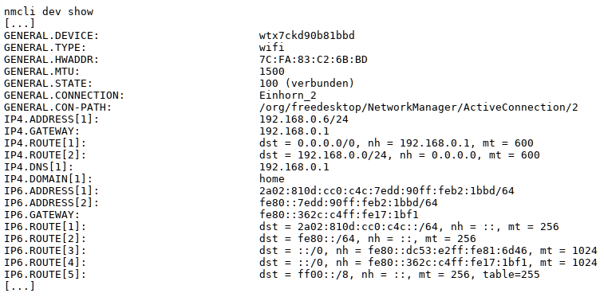
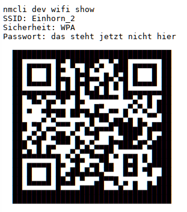

% Network Manager im Terminal

# nmcli

## Allgemeine Hinweise

Der Networkmanager ist mittlerweile ein sehr brauchbarer Ersatz für das Netzwerkkommando  *ifup, ifdown*  bzw.  *ifconfig*  in der Debianwelt geworden. Das Vorurteil das sich der Networkmanager nicht für die Kommandozeile eignet oder gar instabil läuft gehört ins Reich der Märchenwelt. Es existiert ein leistungsfähiger Kommandozeilenclient  **nmcli**  für den täglichen Gebrauch des Networkmanagers.

In den nachfolgenden Beispielen gehen wir von zwei konfigurierten Verbindungen aus. Eine WLAN-Verbindung (Name: Einhorn_2, Interface wtx7ckd90b81bbd, (früher; wlan)) und einer kabelgebundenen Verbindung (Name: Kabelgebundene Verbindung 1, Interface evp0s3f76 (früher: eth0)). Bitte die Verbindungsnamen an eure Gegebenheiten anpassen.

### Installation

Falls der Networkmanager auf dem System noch nicht installiert ist, kann man dies nachholen. Im nachfolgenden Kommando sind alle Pakete die man braucht um alle möglichen Verbindungsarten zu konfigurieren (mobiles Breitband, WLAN und LAN Verbindungen), sowie das grafische KDE-Plasma-Widget für den NM. Bitte alles in eine Zeile eingeben.

~~~sh
apt install network-manager modemmanager mobile-broadband-provider-info network-manager-pptp
 plasma-widget-networkmanagement network-manager-vpnc network-manager-openvpn
~~~

---

## Network Manager 'nmcli' verwenden

Die Eingaben können sowohl in einem virtuellen Terminal (Tastenkombination `Str` + `Umschalt` + `F2`) als auch in der graphischen Oberfläche in einer Konsole getätigt werden. In den abgebildeten Beispielen wurden die Angaben aus Datenschutzgründen abgeändert.

### Konfigurierte Verbindungen anzeigen

Mit dem Kommando  **nmcli c**  können die konfigurierten Verbindungen, die man am System angelegt hat, angezeigt werden.

Im obigen Beispiel sind vier Verbindungen vorhanden WLAN, 2x LAN und eine Mobile Breitbandverbindung.

### Informationen zu WIFI Netzen anzeigen

Welche WLAN-Netze sind überhaupt am Standort verfügbar, das kann man sich in kompakter Form mit  **nmcli dev wifi list**  anzeigen lassen.

### Konfigurierte Geräte anzeigen

Will man wissen welche Geräte (Interfaces) überhaupt dem Networkmanager bekannt sind ist  **nmcli d**  hilfreich.

Sehr detaillierte Informationen (Eigenschaften) gibt es mit  **nmcli dev show**  zu den eigenen verfügbaren Verbindungen. Hier nur der Auszug für das WLAN.

Die Zugangsdaten zum WLAN kann man sich mit **nmcli dev wifi show** anzeigen lassen.

Der zusätzlich generierte QR-Code vereinfacht den Login für Smartphone und Tablet.

### Verbindungen wechseln

Um eine Verbindungsart zu wechseln, z.B. von LAN auf eine WLAN Verbindung, muss man die bestehende aktive Verbindung abbauen und die neue aktivieren. Hier muss man definitiv das Interface angeben, da ein  *nmcli con down id <Name>*  zwar funktioniert, die Verbindung, wenn es eine Systemverbindung ist, aber sofort wieder aufgebaut wird.

Um die automatische Verbindung zu verhindern hilft der Befehl **nmcli dev disconnect <Schnittstellenname>**.  
Zuerst beenden wir die LAN-Verbindung und fragen danach den Status ab.

~~~
# nmcli dev disconnect evp0s3f76
Gerät »evp0s3f76« wurde erfolgreich getrennt.
# nmcli dev status
DEVICE           TYPE      STATE            CONNECTION 
evp0s3f76        ethernet  nicht verbunden  --
wtx7ckd90b81bbd  wifi      nicht verbunden  --
evp3u3           ethernet  nicht verfügbar  --
ttyACM0          gsm       nicht verbunden  --
~~~

Jetzt die WLAN Verbindung aktivieren mit **nmcli con up id <Verbindungsname>**:

~~~
# nmcli con up id Einhorn_2
Verbindung wurde erfolgreich aktiviert 
# nmcli dev status
DEVICE           TYPE      STATE            CONNECTION 
wtx7ckd90b81bbd  wifi      verbunden        Einhorn_2
evp0s3f76        ethernet  nicht verbunden  --
evp3u3           ethernet  nicht verfügbar  --
ttyACM0          gsm       nicht verbunden  --
~~~

Man kann das Ganze noch in eine Kommandozeile packen, dann wird der Wechsel sofort durchgeführt.

Von LAN zu WLAN:

~~~
nmcli dev disconnect evp0s3f76 && sleep 2 && nmcli con up id Einhorn_2
~~~

Umgekehrt von WLAN zu LAN:

~~~
nmcli dev disconnect wtx7ckd90b81bbd && sleep 2 && nmcli con up id 'Kabelgebundene Verbindung 1'
~~~

---

## Weiterführende Informationen

+       
    ~~~
    man nmcli
    ~~~

+ [Ubuntuusers Wiki](https://wiki.ubuntuusers.de/NetworkManager?redirect=no)

---

Zuletzt bearbeitet: 2021-04-19

