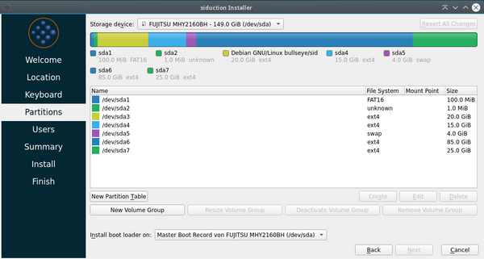
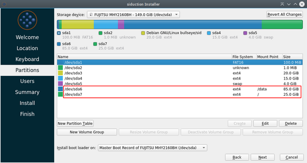
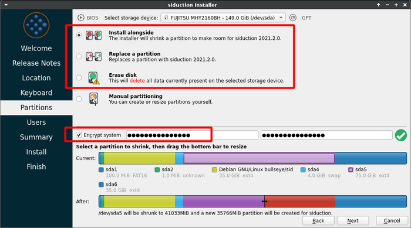
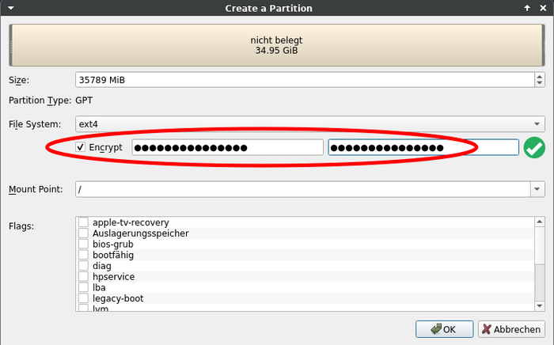

BEGINNING   INFO AREA FOR THE AUTHORS
This area is to be removed when the status RC3 is reached. The first line of the file must contain the title (% my-title) !!!  
**Status: RC2**

Necessary work:

+ check spelling  

Work done

+ check intern links  
+ check extern links (there was'nt any)  
+ check layout  

END   INFO AREA FOR THE AUTHORS  
% Installation on HDD

## Installation on HDD

### Data backup

> **IMPORTANT: ALWAYS CREATE A DATA BACKUP!**  
> If the installation target is already home to an operating system, or data should be preserved, please always create a backup before installing siduction.  

### Installation preparations

First, change the boot order to the medium to be booted (DVD, flashcard or USB stick). On most computers, pressing the 'F2' or 'Del' key during the boot process takes you to the UEFI or BIOS setup. Alternatively, pressing `F12`, `F11` `F7` or `F8` (depending on the hardware manufacturer's specifications) during the boot process will then select the live media as the boot drive.

siduction usually starts without problems now. If this is not the case, boot options (cheat codes) which can be passed to the boot manager are helpful. The manual page [Cheatcodes](0204-cheatcodes_en.md#boot-options-cheatcodes) explains the possible options.  
At the start screen of the live medium, whichever is applicable, navigate with the arrow keys to "From CD/DVD/ISO: ..." or "From Stick/HDD: ..." and press the key 'e'. This takes you to the edit kernel command line to add the cheatcodes. With the key `F10` the boot process is continued.

**Before the installation please remove all USB sticks, cameras etc.**.

If siduction is not to be installed from, but **to a USB medium**, a different procedure is necessary. See the manual page [Installation to a USB medium](0303-hd-ins-opts-oos_en.md#installation-on-usb-stick---memory-card).

**HDD, RAM and Swap**

The minimum requirements for installing the siduction variants are described on the manual page [Live ISO content](0201-cd-content_en.md#minimum-system-requirements).  
With 15 GB hard disk space and 2 GB RAM you are currently on the safe side. 
A swap partition should be created on PCs with a maximum of 1 GB RAM. More than 2 GB swap is not normally required and is only really useful for suspend-to-disk and server systems.

### Partitioning

The partitioning of the drives depends on many factors:

+ Selection of the siduction variant
+ Size of the available drives and RAM
+ Single-boot or dual-boot with an already installed system (Windows, Linux, MAC)
+ Sharing of data for the installed systems

Examples and sizes for different installation situations are described on the manual page [partitioning](0310-part-size-examp_en.md#partitioning-of-installation-media).  
We recommend leaving the **/home** directory on the root partition. The **/home** directory should be the place where individual configurations are stored, and only those. For all other private data, including .ssh, .gnupg and the mail archives, a separate data partition should be created and linked to the **home** directory if necessary. The advantages for data stability, data backup and also in case of data recovery are almost immeasurable.  

The partitioning can be done during the installation, or already in advance during the live session with the following programs:  
[Gparted](0312-part-gparted_en.md#partition-with-gparted), a graphical user interface program for GTK desktops  
KDE Partition Manager, another graphical user interface program for Qt desktops  
[gdisk](0313-part-gdisk_en.md#partition-with-gdisk), recommended for UEFI hardware for GTP partition tables  
[cfdisk](0314-part-cfdisk_en.md#partition-with-fdisk), only for older hardware with traditional BIOS and MBR partition tables

### File systems

We recommend the **ext4** file system, which is used as the default file system on siduction. This applies to all partitions if only Linux operating systems are used.

For a dual-boot installation with *Windows*, a separate data partition with the **NTFS** file system makes sense. Linux can read and write to it; for Windows it is the default file system.

For a dual-boot installation with *MAC*, it also makes sense to have a separate data partition, but with the **HFS** or **HFS+** file system. Linux and MAC can have read and write access to it.

### Duplication to another computer

The following console command is used to create a list of installed software packages so that it can be used to install an identical software selection on another computer or in the event of a new installation:

~~~sh
~# dpkg -l|awk '/^ii/{ print $2 }'|grep -v -e ^lib -e -dev -e $(uname -r) >/home/username/installed.txt
~~~

The best way is to copy this text file to a USB stick or a disk of your choice.  
On the target installation, the text file is copied to $HOME and used as a reference to install the required program packages. The complete package list can be called via

~~~sh
~# apt install $(/home/username/installed.txt)
~~~

can be installed.

### The Calamares installer

During the installation, if possible, the computer should be connected to the Internet, because Calamares uses the GeoIP service to determine default settings for localization and time.

1. the installation program can be started comfortably via the icon  on the desktop or in the menu: *System* > *Install system*.

2. after a double click on the icon Calamares starts and we see the "welcome" window.

   

   If there is an internet connection, the correct language should already be set here.

3. in the next window "location" there is the possibility to make changes to the *region*, the *timezone* and *system language*, as well as the *format* for the date and the numbers.

    

4. next are the settings for the keyboard.

   

   In the upper part the keyboard is displayed graphically and the changes are visible immediately. At the bottom there is an input line to test the keyboard layout.

5. in the next step we reach the already above mentioned partitioning which determines which parts of the harddisk(s) siduction uses.

   

   In our example we use *Manual partitioning* because the partitions have already been created in advance and we only need to select the correct installation target. After clicking *Next* the next window appears where we can select and edit the individual partitions.

   

   We use the partitions  
   sda7 for / (root)  
   sda6 for /data together with the Linux already present on sda3 and sda4.

   After selecting the partition in question and pressing the *Change* button, a window opens in which we enter the above mountpiont and also format sda7 with the **ext4** file system. The partition sda6 is not formatted, because we want to use the data already stored there together with the already existing Linux.  
   We do not need to edit the swap partition (sda5), since it will be automatically detected and integrated during the installation.  
   We can see the result of our efforts in the next image.

   

6. next we set username, login name, computer name, user password and root password (remember them well!). The passwords should not be too simple for security reasons. Additional users can be added after installation in a terminal with [adduser](#adduser).

   

   Before using the two options  
   "Log in automatically without password prompt" and  
   "Use the same password for the administrator account".  
   are explicitly warned here. They represent a security risk in themselves (see also [sudo](term-console_en.md#work-as-root)). If both options are enabled, entering passwords is just a farce!

7. After pressing the *Next* button, a summary of all previously made entries appears. Now there is still the possibility to make changes via *Back*. If we are satisfied with the result, a click on *Install* opens the small warning window in which we have to confirm the installation.

    

8. now the installation starts. This takes some time depending on the hardware. The progress will be displayed accordingly. Even if it takes a little longer, please do not abort the installation, but give the process time.

   

9. at the end we get the possibility to reboot into the newly installed system. 

   

   Remove the CD from the drive before rebooting!

### Encrypt system

From *siduction 2021.2 Farewell* there is the possibility within the installation program Calamares to install the complete system into an encrypted partition or hard disk. Only the first stage of the boot manager *Grub* is located unencrypted on the "*BIOS-boot*" partition. Grub asks for the password for the encrypted installation at every boot process before the boot menu appears.  
The partitioning described in 5 above is now slightly different. When selecting one of the first three options, the function "*Encrypt system*" appears in addition, where we also enter the password at the same time.

If we use "*manual partitioning*", we need an empty, unused area on the hard disk. If this is not available, we first delete one or more partitions that are no longer needed. Then we create the new partition.

In the next step the function "*Encrypt*" is now selectable.

We enter our password and then select the root directory "**/**" as mount point.  
After finishing the partitioning we continue the installation with the menu item *"User"* as described above under 6.

### Add user

To add new users with automatic takeover of group permissions, run the following command as root:

~~~sh
~# adduser <username>
~~~

Pressing Enter leads to further options that allow fine-tuning. This is followed by a prompt to type the password twice.

siduction specific desktop icons (for the manual and IRC) must be added yourself. 

To remove a user

~~~sh
~# deluser <username>
~~~

More information:

~~~sh
man adduser
man deluser
~~~

Last edited: 2021/23/08

