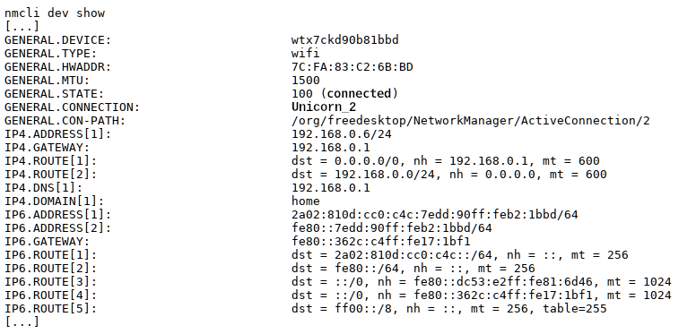
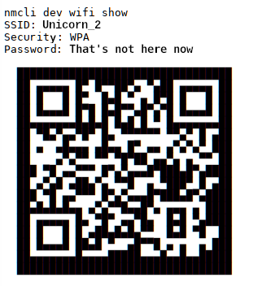

BEGINNING   INFO AREA FOR THE AUTHORS
This area is to be removed when the status RC3 is reached. The first line of the file must contain the title (% my-title) !!!  
**Status: RC2**

Necessary work:

+ check spelling  

Work done

+ check intern links (there was'nt any)  
+ check extern links  
+ check layout  

END   INFO AREA FOR THE AUTHORS  
% Network Manager

## Network Manager Command Line Tool

**General hints**

The network manager is now integrated in all graphical user interfaces of siduction and is mostly self-explanatory. It replaces the network commands *ifup, ifdown* and *ifconfig* used in the terminal. The prejudice that the network manager is not suitable for the command line or even runs unstable belongs to the realm of fairy tales. If no graphical user interface is available, or the command line is preferred, there is with **nmcli** a powerful command line client for the daily use of the network manager.

In the following examples we assume two configured connections. A WLAN connection (name: Unicorn\_2, interface wtx7ckd90b81bbd, (former; wlan)) and a wired connection (name: WiredConnection\_1, interface evp0s3f76 (former: eth0)). Please adapt the connection names to your circumstances.

**Installation of the Network Manager**

If the network manager is not installed on your system, you can install it. In the following command are all packages you need to configure all possible connection types (mobile broadband, WLAN and LAN connections), as well as the graphical KDE plasma widget for the NM. Please enter everything in one line.

~~~sh
apt install network-manager modemmanager mobile-broadband-provider-info network-manager-pptp
 plasma-nm network-manager-vpnc network-manager-openvpn
~~~

### Use Network Manager

The entries can be made both in a virtual terminal (key combination `Ctr` + `Shift` + `F2`) and in the graphical interface in a console. In the examples shown, the information has been changed for privacy reasons.

**Show configured connections**

The command **`nmcli c`** can be used to display the configured connections that have been created on the system.

In the above example there are four connections WLAN, 2x LAN and a Mobile Broadband connection.

**Show information about WIFI networks**.

Which WLAN networks are available at the location at all can be displayed in a compact form with **`nmcli dev wifi list`**.

**Display configured devices**

If you want to know which devices (interfaces) are known to the network manager at all, **`nmcli d`** is helpful.

Very detailed information (properties) is available with **`nmcli dev show`** for the own available connections. Here only the excerpt for the WLAN.

The access data to the WLAN can be displayed with **`nmcli dev wifi show`**.

The additional generated QR code simplifies the login for smartphone and tablet.

**Switch connections**

To change a connection type, e.g. from LAN to WLAN connection, one has to disconnect the existing active connection and activate the new one. Here you definitely have to specify the interface, because a *nmcli con down id <name>* will work, but the connection, if it is a system connection, will be re-established immediately.

To prevent the automatic connection the command **`nmcli dev disconnect <interface name>`** helps.  
First we terminate the LAN connection and then query the status.

~~~
# nmcli dev disconnect evp0s3f76
Device "evp0s3f76" has been disconnected successfully.
# nmcli dev status
DEVICE TYPE STATE CONNECTION 
evp0s3f76 ethernet not connected --
wtx7ckd90b81bbd wifi not connected --
evp3u3 ethernet not available --
ttyACM0 gsm not connected --
~~~

Now enable the wifi connection with **`nmcli con up id <connection name>`**:

~~~
# nmcli con up id Unicorn_2
Connection was successfully activated 
# nmcli dev status
DEVICE TYPE STATE CONNECTION 
wtx7ckd90b81bbd wifi connected Unicorn_2
evp0s3f76 ethernet not connected --
evp3u3 ethernet not available --
ttyACM0 gsm not connected --
~~~

You can still put the whole thing in a command line, then the change will be done immediately.

From LAN to WLAN:

~~~
nmcli dev disconnect evp0s3f76 && sleep 2 && nmcli con up id Unicorn_2
~~~

Reversed from WLAN to LAN:

~~~
nmcli dev disconnect wtx7ckd90b81bbd && sleep 2 && nmcli con up id 'WiredConnection_1'.
~~~

### Further information

+       
  ~~~
  man nmcli
  ~~~

+ [Ubuntu community NetworkManager](https://help.ubuntu.com/community/NetworkManager)

Last edited: 2021/23/08

