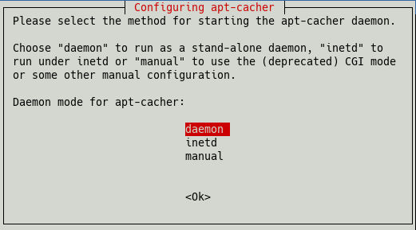

% Local APT mirror

## Local APT mirror

**Apt-Cacher**, a proxy server for Debian packages

Apt-Cacher is a proxy server that allows multiple local computers access to a
Debian package cache.  
The packages requested for installation from a computer at the cache only need to be loaded once from Debian mirror servers, no matter how many devices need these packages. This saves network bandwidth, increases speed for users, and reduces load on the mirrors.

For users who own multiple PCs and want to conserve bandwidth and download volume while increasing the speed of system updates, apt-cacher is the ideal solution to achieve all these goals.

Apt-Cacher is not a universal proxy server. Whoever tries this anyway will experience some unpleasant surprises in the network.

**Prerequisites**

+ a PC on which the local APT proxy server will be set up
+ 6 GB free disk space for the cache on the server
+ LAN connection to the other devices

**Apt-Cacher Setup**

The setup for apt-cacher is done in two steps.  
First you install apt-cacher on the PC selected as APT proxy server, and then you configure all client PCs to use the APT proxy server.

### Install server

After an **`apt update`** the necessary packages are installed with the following command:

~~~
# apt install apt-cacher
[...]
The following NEW packages will be installed:
  apt-cacher ed libberkeleydb-perl libcompress-raw-bzip2-perl
  libcompress-raw-lzma-perl libcompress-raw-zlib-perl libfilesys-df-perl
  libio-compress-zma-perl libio-compress-perl libio-interactive-perl
  libio-interface-perl libipc-shareable-perl libnetaddr-ip-perl libsocket6-perl
  libsys-syscall-perl libww-curl-perl
0 updated, 16 reinstalled, 0 to remove and 0 not updated.
992 kB of archives need to be downloaded.
After this operation, 3,205 kB of additional disk space will be used.
Do you want to continue? [Y]
~~~

During the installation of apt-cacher the basic configuration is done automatically.

Keep and confirm the recommended daemon mode *"daemon"*.

The cache, where all downloaded packages will be stored in the future, is located in  
`/var/cache/apt-cacher/`  
and the configuration files in  
`/etc/apt-cacher/`.

**Server configuration**

We change to the directory `/etc/apt-cacher/` and edit the file `apt-cacher.conf`.

~~~
# cd /etc/apt-cacher
/etc/apt-cacher# mcedit apt-cacher.conf
~~~

Now, somewhere around line 160, we look for the directive *"allowed_hosts"*. Remove the comment sign (*"#"*) at the beginning of the line to allow clients to contact the APT proxy server.  
For security reasons, we replace the wildcard character (*"\*"*), which allows everyone to access, with the IP addresses of the clients.

~~~
#allowed_hosts = *
~~~

For example, change it to

~~~
allowed_hosts = '192.168.3.10-20'
~~~

Of course, the IP addresses must be adapted to your own circumstances. Explanations of the syntax are in the file immediately before the directive.  
If there is a DHCP server operating in your own network, it is necessary to assign a fixed IP to the APT proxy server, e.g. *"192.168.3.5"*.

In the following, we need to specifiy the *"user"* and the *"group"* which the daemon runs with and the port on which the daemon listens (all of them in the `apt-cacher.conf` file):

~~~
group = www-data
user = www-data
daemon_port = 3142
~~~

These are the default values, which we do not change. After saving the file we exit mcedit.

If a cache directory other than `/var/cache/apt-cacher/` is to be used, the owner and file permissions must be checked and adjusted (`chmod 644` for the files).

To make sure that the APT proxy server starts automatically every time the server is booted, we issue the following command:

~~~
# systemctl enable apt-cacher.service
~~~

The APT proxy server is now also restarted and thus the changed configuration is read in.  
We check if it is active and listening on port 3142.

~~~
# ss -tl | grep 3142
LISTEN 0 4096 0.0.0:3142 0.0.0.0:
~~~

Everything is fine with this output.

**Import of existing .deb's**

Apt-Cacher now has an import script that imports Debian archives already present on the PC. It saves downloading the packages again. We give the existing archive directory to the call:

~~~
# /usr/share/apt-cacher/apt-cacher-import.pl /var/cache/apt/archives/
~~~

Called with `-h`, we get usage instructions and a listing of all options.

### Client configuration

The clients accessing the APT proxy server require only minor configuration.

First we create the file `30proxy` in the directory `/etc/apt/apt.conf.d/` which instructs apt to use the server. Here we use the above mentioned IP of the server. Please adapt the IP to your own circumstances.

~~~
# echo "Acquire::http { proxy "http://192.168.3.5:3142"; };" > /etc/apt/apt.conf.d/30proxy
~~~

Next, we change the addresses of the download mirrors in the directory `/etc/apt/sources.list.d/` from "https" to "http" within the files `debian.list`, `extra.list`, and `fixes.list`.  
Using "https" is possible: On the one hand it requires some configuration effort, and on the other hand it is not necessary at the moment because all download mirrors still accept "http".

A subsequent

~~~
# apt update
~~~

should run without error messages.  
The first call of **`# apt full-upgrade`** on a client loads all new packages into the cache of the APT proxy server. Thus, this process takes the same amount of time as before. The further accesses of the clients make use of the cache and then run substantially faster, without requiring bandwidth again.

Last edited: 2022/04/05

